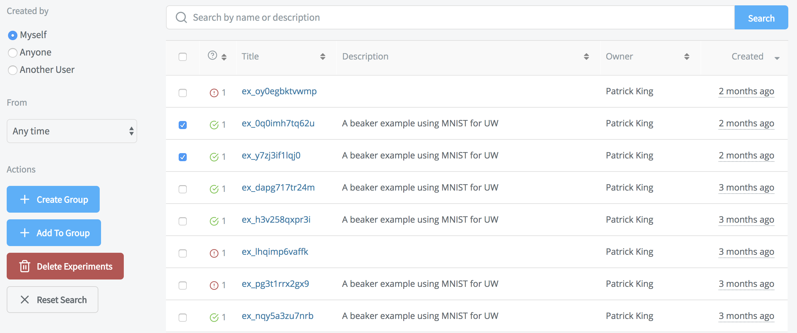
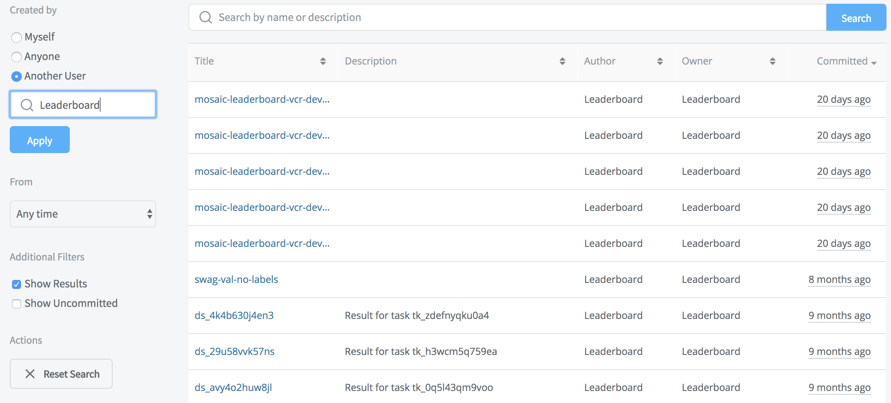
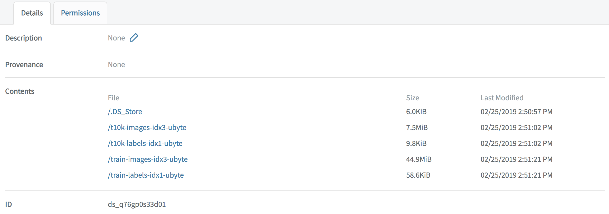
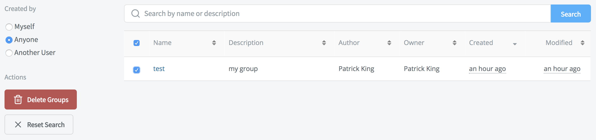
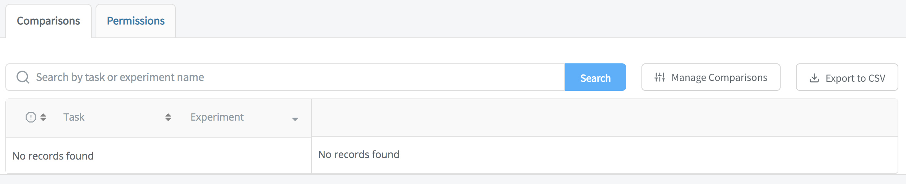
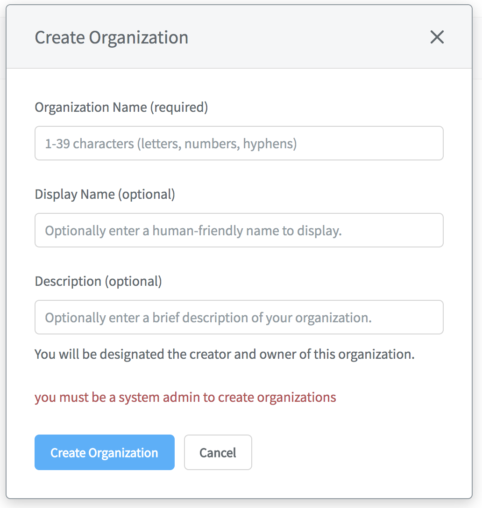

# Beaker Site

Sign in to [Beaker.org](https://beaker.org) to manage your account, permissions, and to report useful metrics about experiments and datasets.

## Experiments

Search and sort experiments by yourself, others, or by a specified timeframe.

### Actions

Select experiments in the list, then choose:

* **Create Group** to group them and provide a description
* **Add To Group** if a group already exists
* **Delete Experiments** to remove them from the system
* **Reset Search** to clear the current search filter

## Datasets

## Experiments

Search and sort datasets of your or others' experiments, or by a specified timeframe. You can also filter to **Show Results** or **Show Uncommitted** datasets.

### Actions

* **Reset Search** to clear the current search filter

### Dataset Details

Select a dataset to show its **Description**, **Provenance**, **Contents**, and **ID**.

Select **Permissions** to change a dataset's default:  **None** or **Read**.

## Groups

Search and sort groups of your or others' experiments, or by a specified timeframe. 

### Actions

Select groups in the list, then choose:

* **Delete Groups** to remove them from the system
* **Reset Search** to clear the current search filter

**Note:** To create a group or add experiments to a group, choose **Experiments** from the Beaker site menu, as above.

### Group Details

Select a group to show and manage its **Comparisons**, or to **Export to CSV**.

Select a comparison to specify its Metrics and Environment Variables.

Select **Permissions** to change a group's default:  **None** or **Read**.

## Organizations

On the right site of the Beaker site menu, by your username, is **Personal** or your organization name.

Select your organization to switch organization contexts or to access **Settings**. If you are a Beaker system administrator, create new organizations by choosing **New...**. 

