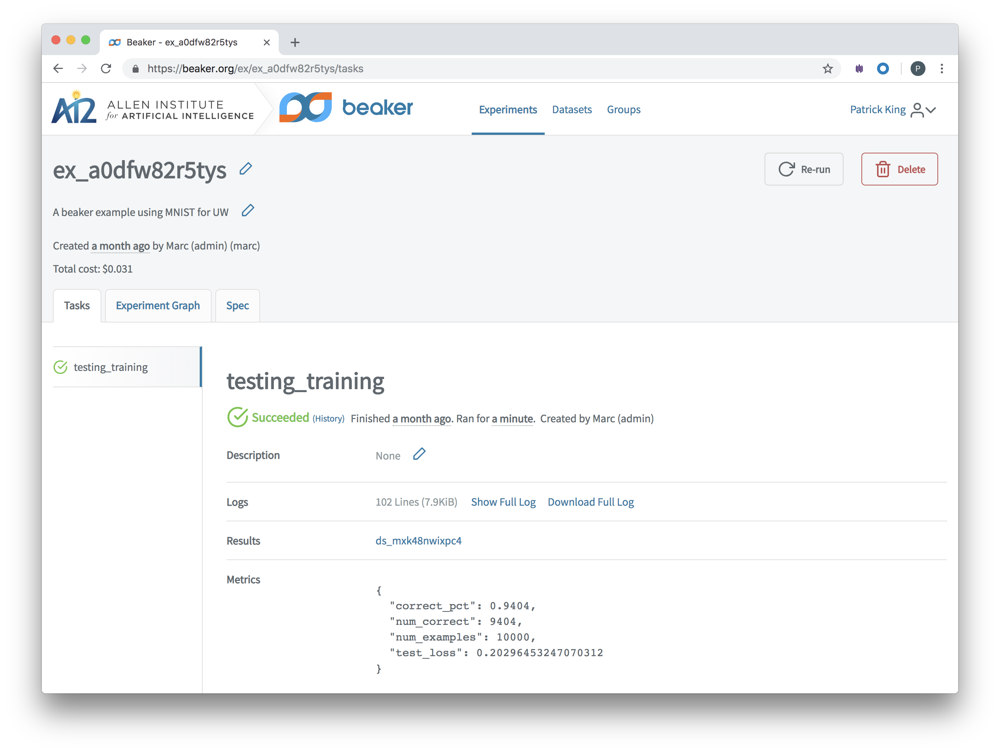
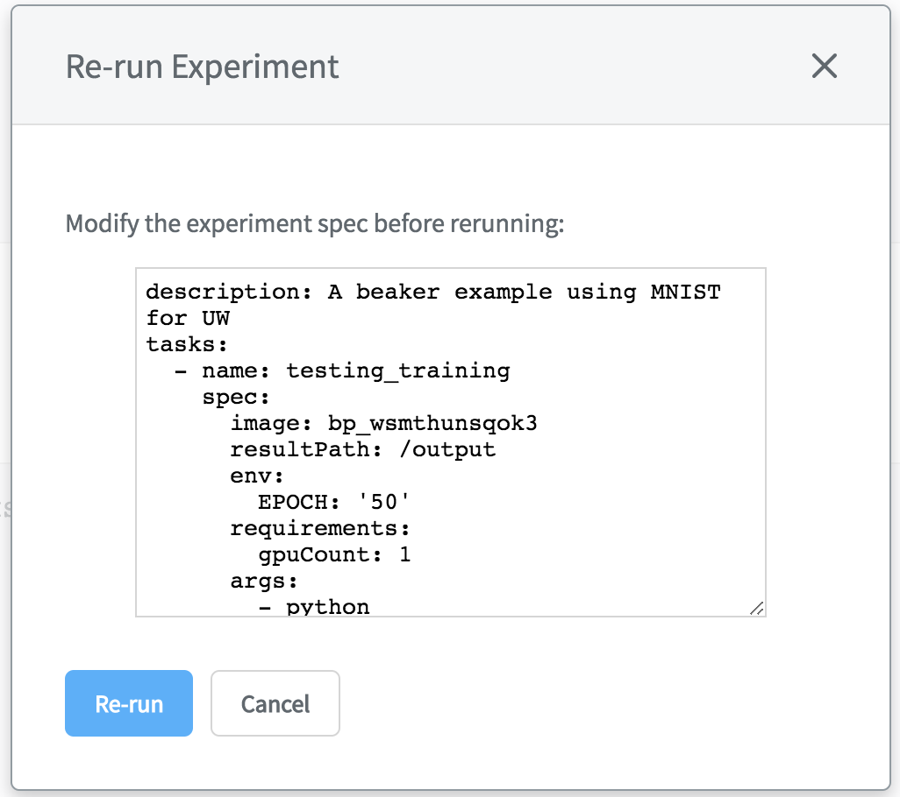
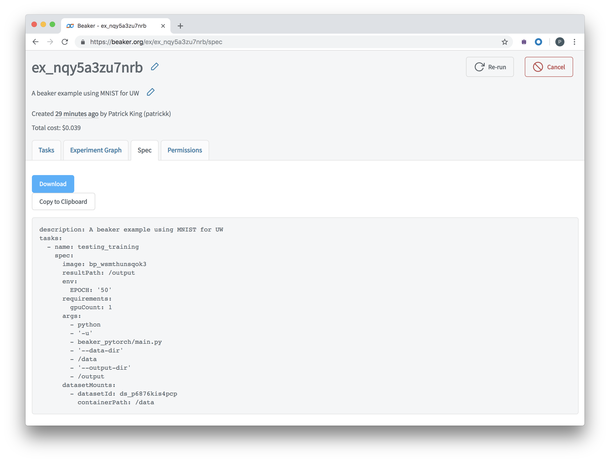

# Your First Beaker Experiment

Beaker manages experiments as Docker containers combined with additional metadata to make your code and data easy to share and replicate. To show you how to do this with "real" code and data, this tutorial will show you how to train a Python Pytorch model using LeCun's MNIST dataset of images of handwritten digits.

Don't worry if you don't know about Python, Pytorch, or MNIST data; you won't need to here. This exercise simply shows you how to run a full experiment with Beaker in a way that should be easy to understand.

## Experiments on Beaker.org

First, go to the [MNIST example](https://beaker.org/ex/ex_kjkr81zmbfio) page on Beaker.org. (Sign in if you haven't already.)



You can see an existing experiment, already provided by Beaker. You can click around, to see Beaker features such as its **Experiment Graph** and **Spec**.

Re-run this experiment in the Beaker clould by simply clicking **Re-run** in the top-right corner of the experiment page. If you do so, don't modify the experiment spec; just confirm by clicking **Re-run** from **Re-run Experiment**.



You should see a new experiment page with a unique experiment ID, and watch its task progress through provisioning to completion. When complete you can now see this re-run experiment's information on Beaker.org.

That's how Beaker makes experiments simple to share with others, and keeps track of different runs of a base experiment.

Next, you should use the Beaker CLI to run the same experiment from your local machine.

## Local experiments

For these steps to work, you must have completed [installing Beaker](install.md). When installed:

1. From the existing [MNIST example](https://beaker.org/ex/ex_kjkr81zmbfio) experiment page on Beaker.org, click the **Spec** tab.



2. Click **Download** to save the experiment's YAML spec file to a location on your local hard drive.

3. From the command line at this directory, enter:

    ```bash
    beaker experiment create -f experiment.yaml
    ```

You should see the following output:

```bash
Experiment <experiment_id> submitted. See progress at https://beaker.org/ex/<experiment_id>
```

The resulting experiment ID is unique to every experiment run.

You can see your experiments tasks progress to completion at the URL provided by this output (for example, [https://beaker.org/ex/ex_kjkr81zmbfio](https://beaker.org/ex/ex_kjkr81zmbfio)).

That's how an experiment is defined and shared by its spec, the YAML file containing the necessary metadata with which you can manage an experiment.

If both of the above steps are working for you, you are ready to proceed to creating your own Beaker image and dataset, which is the [next example](image.md).
